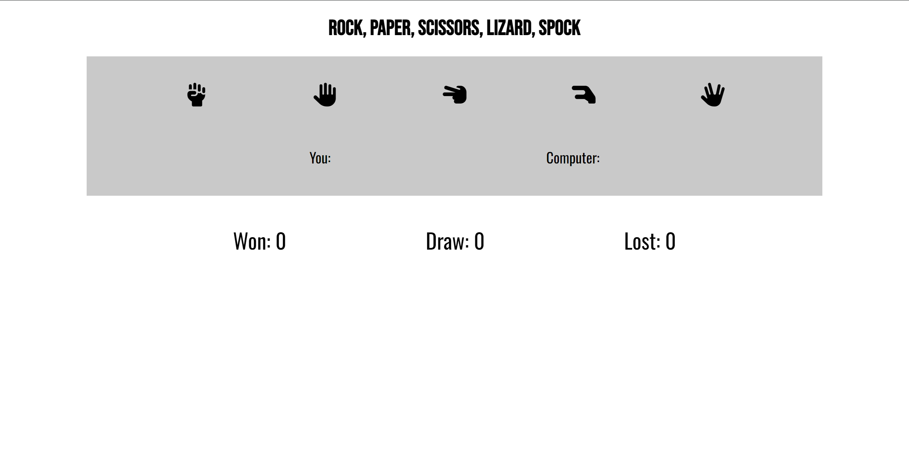

<h1 align="center">Rock, Paper, Scissors, Lizard, Spock</h1>

View the website [here](https://maxxkm.github.io/CI-Project-2)

This is a website that allows the user to play a game of Rock, Paper, Scissors, Lizard, Spock against a computer.

## User Experience (UX)

- ### User Stories

  - #### First Time Visitor Goals

    1. As a first time visitor, I want to have a enjoyable experience playing the sites game.
    2. As a first time visitor, I want to be able to easily navigate through the website.
    3. As a first time visitor, I want to have interactive experience on the site.

  - #### Returning Visitor Goals

    1. As a returning visitor, I want to have replayability of the game.
    2. As a returning visitor, I want to be able to challenge my previous scores and better them.

- ### Design

  - #### Colour Scheme

    - The two main colours used in this project are white and medium grey. I wanted to keep the colour scheme as simple as possible and have the main focus on the game.

  - #### Typography

    - The font that was used for the heading was 'Bebas-Neue' with a fallback of sans-serif since it has a very sharp and bold look to it. It suits the theme of the website since it is quite a simple looking website and the title is clear and readable for the name of the game.
    - The font that was used for the body was 'Oswald' with a fallback of sans-serif. Again the purpose behind this is that the site has a clean and simple look to it, so the text needs to be readable, especially with the scores updating. It isn't as bold as the header font so it doesn't distract the user from the heading.

  - #### Imagery

    - There was not many imagery used in this project, how ever I used icons from [FontAwesome](https://fontawesome.com) for the hand images for the choices of the game. I decided to go for the clean and black font since its easily readable and suits the colour scheme of the site. I tried the yellow and outlined icons but they seemed out of place.

## Features

- #### User Choice Selection
  - Added features to the game area where the users can select what choice they want to play against the computer. The icons grow when the user hovers over them and eases in and out. Also the mouse icon changes to notify the user that they are clickable.
    

- #### Reveal Area
  - Added the reveal area to show what the user has picked and what the computer has picked. The icons are much bigger than the choice icons, so that they are easily seen when playing. The icons match the icons in the choice area.
    

- #### Score Area
  - Added score area below the game, to show the user the current score of the game. The user can see the win, draw and lose scores increment up as they play to keep track of how they are doing.
    

- #### Responsiveness
  - The website is responsive to different screen sizes.
    

## Technologies Used

### Languages used

- [HTML5](https://en.wikipedia.org/wiki/HTML)
- [CSS3](https://en.wikipedia.org/wiki/CSS)

### Framesworks, Libraries & Programmes Used

1. [Google Fonts](https://fonts.google.com/)
    Google Fonts was used to styles the font throughout the website.
2. [Font Awesome](https://fontawesome.com/)
    Font Awesome was used to add the icons for the icons for the users choices and the reveal icons.
3. [Git](https://git-scm.com)
    Git was used for version control by utilizing the Gitpod terminal to commit to Git and push to GitHub.
4. [GitHub](https://github.com/)
    GitHub was used to store the projects code after being pushed by Git.
5. [Balsamiq](https://balsamiq.com)
    Balsamiq was used to make the wireframes, to plan the visual style and layout of the website before the initial code was written.
6. [Favicon.io](https://favicon.io/favicon-converter/)
    Favicon was used to generate favicon files from an image.

## Testing

The W3C Markup Validator and W3C CSS Validator Services were used to validate every page of the project to ensure there were no syntax errors in the project.

- [W3C Markup Validator](https://validator.w3.org/)
- [W3C CSS VALDATOR](https://jigsaw.w3.org/css-validator/)

### Testing User Stories from User Experience (UX) Section

- #### First Time Visitor Goals

   1. As a first time visitor, I want to have a enjoyable experience playing the sites game.
      1. The game features a more complex version of Rock, Paper, Scissors adding more interest to the game.
      2. The computer randomly generates choices against the player, so the player has the ability to play versus something.
   2. As a first time visitor, I want to be able to easily navigate through the website.
      1. The color scheme is simple and clean, and has contrast between areas allowing easy visiblity to where the player should be looking.
      2. The icons are well contrasted and simple in design, giving easy selection for the player. it also features a different mouse icon to show the player they are clickable.
      3. Font througout the site is clean and easily readable.  
   3. As a first time visitor, I want to have interactive experience on the site.
      1. The player has multiple options to select, to use against the computer's choices.
      2. The selectable icons grow as the user hovers over them giving them an enjoyable selection of choices.
  
- #### Returning Visitor Goals

   1. As a returning visitor, I want to have replayability of the game.
      1. The player can play the game for however long they desire, due to no limits.
      2. The scores are reset everytime the site is refreshed.
   2. As a returning visitor, I want to be able to challenge my previous scores and better them.
      1. Score is tracked as the user plays, giving them the information on how well they are doing.
      2. Since the scores reset, the user can try beat their previous scores. 

### Further Testing

- The website was viewed on multiple devices such as iphone 15, laptop, tablet, PC.
- All selection buttons were tested at multiple stages to make sure they work.
- the computer's choices and the scores were testing at each stage of development to ensure they working correctly.

### Known bugs

- The icons on some mobiles appear blue.
- The site used to feature a piece of text, notifying the user if they won or not, this was glitchy throughout development and I tried multiple different was to code it in. Unfortunately to no avail, so I decided to remove the feature due to it's unreliability.
- Not so much a bug, but since I used favicon icons for the revealed choices icons, I had to rename 'rock' in the code to 'fist', since to show the icons I needed their specific names on the favicon site.
